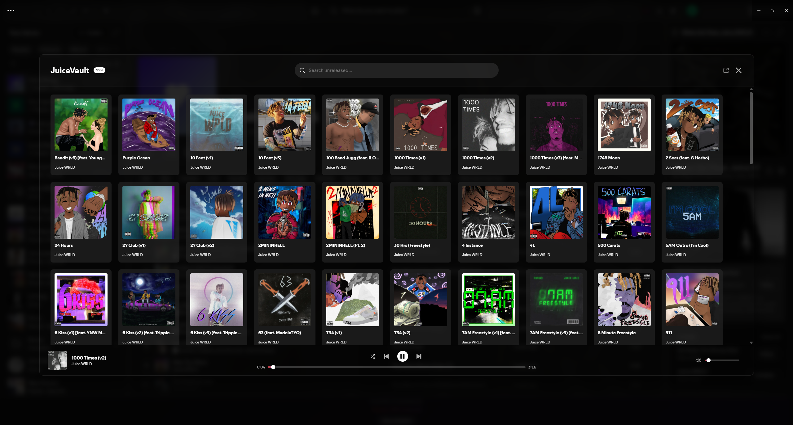

# Juice Vault

A Spicetify extension that lets you stream and download unreleased Juice WRLD tracks directly in Spotify.

## Features

- 🎵 **1,400+ Unreleased Songs** - Access a massive vault of unreleased Juice WRLD tracks
- 🔍 **Search** - Find songs instantly with real-time search
- ▶️ **Integrated Player** - Play vault songs without leaving Spotify
- ⬇️ **Download** - Download any song directly to your device
- 🔊 **Volume Sync** - Volume syncs with Spotify's volume controls
- 🎨 **Modern UI** - Beautiful gradient-styled player with Spotify-like aesthetics

## Installation

### Via Spicetify Marketplace (Recommended)
1. Open Spicetify Marketplace
2. Search for "JuiceVault" (you may need to click a view more button)
3. Click Install

### Manual Installation
1. Download `JuiceVault.js`
2. Copy to your Spicetify extensions folder:
   - Windows: `%appdata%\spicetify\Extensions\`
   - Linux/macOS: `~/.config/spicetify/Extensions/`
3. Run `spicetify config extensions JuiceVault.js`
4. Run `spicetify apply`

## Usage

1. Click the "999" button in the top bar
2. Browse or search for songs
3. Click a song card to play
4. Hover over a song to reveal the download button
5. Click "Website" to visit the full JuiceVault site

## Credits

- API provided by [juicevault.xyz](https://api.juicevault.xyz/docs)
- API & Extension created by AjaxFNC, project base created by prototbh

### This is a fan-made project made with 💜 for Juice WRLD. Not affiliated with Grade A Productions or Spotify.
