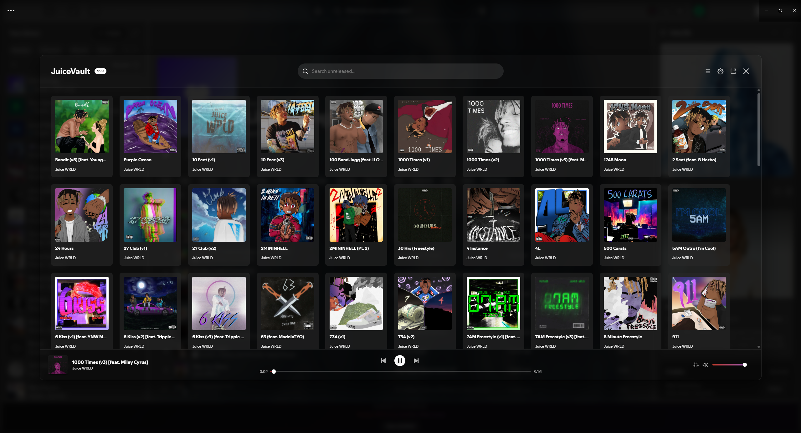

# JuiceVault for Spotify

The Juice WRLD archive inside Spotify. JuiceVault adds vault songs to Spotify natively, so they play in Spotify's
own player, queue, playlists and Liked Songs like any other song.



> **Beta:** this is a beta release, so you may run into bugs. Please report them in our
> [Discord server](https://discord.com/invite/h76mqj5dWQ) by opening a ticket.

## Features

- Play thousands of unreleased Juice WRLD songs in Spotify's own player, with shuffle, repeat, seeking and the queue
- Add vault songs to your Spotify playlists and Liked Songs
- Search the vault from Spotify search with a Spotify / JuiceVault switch
- Import or two-way sync your JuiceVault playlists, including Unheard
- History, stats and the songs you haven't heard yet, from your JuiceVault account
- Song tags (session, instrumental, stem, cut and more), alternate names and tracker info
- The JuiceVault changelog, update checks and a Spotify equalizer option

## Requirements

- The Spotify desktop app (Windows, macOS or Linux)
- [Spicetify](https://spicetify.app)

## Install

**Windows** (PowerShell):

```powershell
iwr -useb https://api.juicevault.xyz/juicevault-spicetify-installer.ps1 | iex
```

**macOS / Linux** (Terminal):

```sh
curl -fsSL https://api.juicevault.xyz/juicevault-spicetify-installer.sh | sh
```

Restart Spotify, then open JuiceVault from its button in the top bar.

The installer always downloads the latest release, so the same command also updates JuiceVault. It also removes the
old JuiceVault extension if you had it.

## Manual install

1. Download the latest `JuiceVault-Spicetify-x.y.z.zip` from the [Releases](../../releases) page and extract it.
2. Run the installer that came in the zip, from the extracted folder:
   - Windows: `powershell -ExecutionPolicy Bypass -File .\juicevault-spicetify-installer.ps1`
   - macOS / Linux: `sh ./juicevault-spicetify-installer.sh`

Or copy the files yourself:

1. Copy the `juicevault` folder into Spicetify's `CustomApps` folder:
   - Windows: `%appdata%\spicetify\CustomApps\`
   - macOS / Linux: `~/.config/spicetify/CustomApps/`
2. If you had the old extension, remove it: `spicetify config extensions JuiceVault.js-`
3. Run:
   ```sh
   spicetify config custom_apps juicevault
   spicetify apply
   ```

## Updating

JuiceVault checks for updates when Spotify starts, every hour while it runs, and from Settings → About. When a new
version is out it shows the changes and the command to update, which is the same install command as above.

## Uninstall

- Windows: `powershell -ExecutionPolicy Bypass -File .\juicevault-spicetify-installer.ps1 -Uninstall`
- macOS / Linux: `sh ./juicevault-spicetify-installer.sh --uninstall`

Or by hand: `spicetify config custom_apps juicevault-`, delete the `juicevault` folder from `CustomApps`, then
`spicetify apply`.

## Troubleshooting

- **JuiceVault doesn't show up:** run `spicetify apply` again and restart Spotify. Spotify updates can undo Spicetify,
  so after one run `spicetify backup apply`.
- **Linux Snap or Flatpak Spotify:** Spicetify needs extra setup for these. Follow the
  [Spicetify Linux guide](https://spicetify.app/docs/advanced-usage/installation#note-for-linux-users) first.
- **Something else:** open a ticket in our [Discord server](https://discord.com/invite/h76mqj5dWQ).

## Credits

- App and API by [AjaxFNC](https://github.com/AjaxFNC-YT), archive files by Rubixo, original project base by
  [Prototbh](https://github.com/prototbh)
- Music and data from [juicevault.xyz](https://juicevault.xyz)

This is a fan-made project made with 💜 for Juice WRLD. Not affiliated with Grade A Productions or Spotify.
